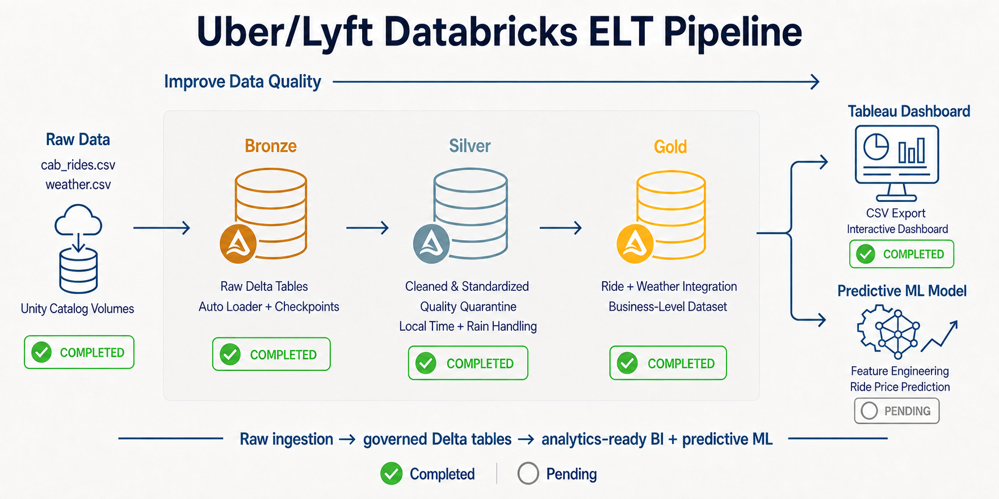
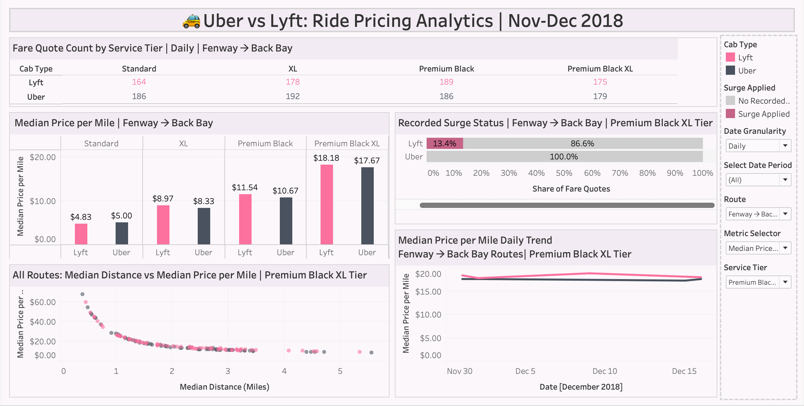

# Uber vs Lyft Fare Analytics | Databricks ELT, Tableau BI & Machine Learning

An end-to-end data engineering and analytics project that transforms public Uber/Lyft fare estimates and Boston weather observations into governed Delta tables, a Tableau-ready dataset, an interactive Tableau dashboard, and a future ride-fare predictive model.

The project demonstrates three connected delivery stages:

1. **Databricks ELT pipeline:** ingest, validate, clean, standardize, integrate, and publish data through Bronze, Silver, and Gold layers.
2. **Tableau analytics:** export the curated Gold dataset and build an interactive fare-analysis dashboard packaged with its data extract.
3. **Predictive modeling:** engineer leakage-safe features and train a model to estimate ride fares.

## Current Architecture

```text
Kaggle source files
    │
    ▼
Unity Catalog Volumes
    │
    ▼
Databricks ELT Pipeline
    ├── Bronze: raw Delta tables + Auto Loader checkpoints
    ├── Silver: cleaning, standardization, enrichment, and quarantine
    └── Gold: fare quotes joined with source/destination weather
           │
           ├── Tableau-ready CSV ──► Packaged Tableau dashboard
           │
           └── Curated Gold data ──► Predictive ride-fare model
```

In this ELT design, the CSV files are loaded into Databricks before the main business transformations occur. Bronze, Silver, and Gold transformations therefore form the **Transform** stage of ELT.

## Architecture Progress



The Databricks ELT layers and Tableau dashboard are complete. Predictive modeling is the remaining planned stage.

## Pipeline Status

| Stage | Status | Result |
|---|---|---|
| Kaggle source data | ✅ Completed | `cab_rides.csv` and `weather.csv` identified and downloaded |
| Unity Catalog volumes | ✅ Completed | Governed source, checkpoint, and export storage created |
| Bronze | ✅ Completed | Raw CSV data ingested with Auto Loader into Delta tables |
| Silver | ✅ Completed | Fare and weather data cleaned, standardized, enriched, and validated |
| Gold | ✅ Completed | Fare quotes matched to source and destination weather observations |
| Tableau export | ✅ Completed | Validated 35-column CSV created from the curated Gold table |
| Tableau dashboard development | ✅ Completed | Interactive fare, distance, trend, and recorded-surge dashboard packaged as a `.twbx` workbook |
| Predictive ML model | ⏭️ Next | Engineer features, train models, and evaluate fare predictions |

## Data Source

The project uses the public [Uber & Lyft Cab Prices dataset on Kaggle](https://www.kaggle.com/datasets/ravi72munde/uber-lyft-cab-prices), published under the **CC0: Public Domain** license.

Source files:

- `cab_rides.csv` — Uber/Lyft fare estimates, provider and product information, locations, distance, price, and surge multiplier.
- `weather.csv` — weather observations for the Boston locations represented in the fare data.

Important context:

- The records represent queried fare estimates, not confirmed completed trips.
- `time_stamp` records the epoch time when the fare data was queried.
- The source files cover selected Boston locations during November and December 2018.

The large source CSV files are not duplicated in this repository. Download them from Kaggle and upload them to the corresponding Unity Catalog volumes before running the ingestion notebook.

## Unity Catalog Design

```text
rideshare_elt
├── bronze
│   ├── cab_rides_raw
│   └── weather_raw
├── silver
│   ├── cab_rides_clean
│   ├── cab_rides_quarantine
│   └── weather_clean
└── gold
    └── rides_weather_enriched
```

Unity Catalog volumes hold the cab-rides source file, weather source file, Auto Loader checkpoints, and Tableau exports. The Tableau CSV is written to:

```text
/Volumes/rideshare_elt/gold/tableau_exports/rideshare_gold.csv
```

## Bronze Layer

The Bronze layer preserves the original source values while adding ingestion metadata, rescued-data handling, and Auto Loader checkpoints.

### Bronze Delta Tables

- `rideshare_elt.bronze.cab_rides_raw`
- `rideshare_elt.bronze.weather_raw`

### Bronze Validation

| Dataset | Rows | Nullable field | Null rows | Null rate | Rescued rows | Source files |
|---|---:|---|---:|---:|---:|---:|
| Cab rides | 693,071 | `price` | 55,095 | 7.95% | 0 | 1 |
| Weather | 6,276 | `rain` | 5,382 | 85.76% | 0 | 1 |

- Missing cab prices remain unchanged in Bronze.
- Missing weather rain values remain unchanged in the original `rain` column.
- Zero rescued rows confirms that the source columns matched the declared ingestion schemas.
- Auto Loader checkpoints prevent already processed files from being ingested again.

## Silver Layer

The Silver layer applies analytical quality rules while preserving rejected fare records in quarantine.

### Silver Delta Tables

| Table | Rows | Purpose |
|---|---:|---|
| `rideshare_elt.silver.cab_rides_clean` | 637,976 | Valid fare quotes with usable prices |
| `rideshare_elt.silver.cab_rides_quarantine` | 55,095 | Fare quotes excluded from price analysis because price is missing |
| `rideshare_elt.silver.weather_clean` | 6,276 | Cleaned and standardized weather observations |

The 637,976 clean and 55,095 quarantined fare records reconcile to all 693,071 Bronze records.

### Key Silver Transformations

- Converted 13-digit fare-query epochs from milliseconds to UTC.
- Converted 10-digit weather epochs from seconds to UTC.
- Created Boston-local timestamps using `America/New_York`.
- Added local date, hour, weekday, and weekend fields.
- Standardized location, provider, and ride-product text.
- Added surge indicators and price-per-mile calculations.
- Preserved missing-price records in quarantine.
- Preserved nullable source rain while adding analytics-ready `rain_amount` and `is_raining` fields.
- Validated unique ride IDs and unique weather location–timestamp keys.

## Gold Layer

The Gold layer matches every valid fare quote to the nearest weather observation at both its source and destination. Both matches use the fare-query timestamp and a maximum tolerance of 60 minutes.

### Gold Delta Table

- `rideshare_elt.gold.rides_weather_enriched`

### Gold Validation

| Metric | Result |
|---|---:|
| Rows | 637,976 |
| Unique fare-quote IDs | 637,976 |
| Curated columns | 36 |
| Source-weather match rate | 100% |
| Destination-weather match rate | 100% |
| Weather-tolerance violations | 0 |

The resulting grain is exactly one row per valid fare quote. The table retains identifiers, provider and product attributes, source and destination locations, fare measures, query-time fields, endpoint weather features, and Gold refresh metadata.

## Tableau Delivery

The Tableau export notebook removes the pipeline-only `_gold_created_at` field and produces a 35-column CSV for the packaged Tableau workbook.

| Metric | Result |
|---|---:|
| Exported rows | 637,976 |
| Unique fare-quote IDs | 637,976 |
| Exported columns | 35 |
| Export file | `rideshare_gold.csv` |
| Export size | 199.52 MB |

The exported CSV was read back into Spark and validated before download. It is excluded from regular Git tracking because its size exceeds GitHub's standard per-file limit.

### Interactive Dashboard

The completed local dashboard is packaged with its embedded Tableau extract and stored at:

- [`tableau/uber_lyft_fare_comparison.twbx`](tableau/uber_lyft_fare_comparison.twbx)



The dashboard, **Uber vs Lyft: Ride Pricing Analytics | Nov-Dec 2018**, includes:

- Fare-quote counts by comparable service tier.
- Route-level median price and median price-per-mile comparisons.
- Median distance versus pricing analysis across routes.
- Daily pricing trends for the selected route and service tier.
- Recorded surge-status comparison by provider.
- Interactive date-granularity, date-period, route, pricing-metric, and service-tier controls.
- Consistent Lyft-pink and Uber-dark-gray visual encoding.

The dashboard describes **fare quotes**, not completed bookings or realized revenue. The recorded surge comparison also reflects only the source `surge_multiplier` field: Uber has no values above `1` in this dataset, which should not be interpreted as proof that Uber never used dynamic pricing.

The packaged workbook is approximately 31 MB and can be downloaded directly from GitHub. Publishing it to Tableau Public is optional and is not required to use the packaged workbook.

## Predictive Modeling Plan

With the Tableau dashboard complete, the governed Gold data will support the next ride-fare regression workflow.

Planned candidate features include provider, ride product, distance, surge multiplier, source, destination, route, local query time, temperature, rain, humidity, cloud cover, pressure, and wind.

The target variable will be `price`. Derived fields such as `price_per_mile` must not be used as model inputs because they contain the target price and would introduce data leakage. Pipeline metadata such as `_gold_created_at` will also be excluded from modeling features.

## Notebooks

| Notebook | Status | Purpose |
|---|---|---|
| `00_Environment_Validation.py` | ✅ Completed | Validate source files, schemas, volumes, and compute |
| `01_Bronze_Ingestion.py` | ✅ Completed | Incrementally ingest raw CSV files with Auto Loader |
| `02_Silver_Transformations.py` | ✅ Completed | Clean, standardize, enrich, and quarantine records |
| `03_Gold_Analytics.py` | ✅ Completed | Integrate fares with source and destination weather |
| `04_Tableau_Export.py` | ✅ Completed | Validate and export the Tableau-ready Gold CSV |
| `05_ML_Price_Prediction.py` | ⬜ Planned | Train and evaluate ride-fare prediction models |

## Repository Structure

```text
Uber_Lyft_Databricks_ELT_Tableau
├── notebooks
│   ├── 00_Environment_Validation.py
│   ├── 01_Bronze_Ingestion.py
│   ├── 02_Silver_Transformations.py
│   ├── 03_Gold_Analytics.py
│   └── 04_Tableau_Export.py
├── data
│   ├── raw                  # Original Source CSVs; excluded from Git
│   └── .gitkeep
├── tableau
│   ├── data                              # Local Tableau CSV; excluded from Git
│   ├── uber_lyft_fare_comparison.twbx   # Packaged dashboard with embedded extract
│   └── .gitkeep
├── images
│   ├── uber_lyft_databricks_tableau_ml_architecture.png
│   └── uber_lyft_tableau_dashboard.png
├── docs
├── sql
├── .gitignore
└── README.md
```

### Supporting Folders

- `docs/` — stores supporting project documentation, such as the data dictionary, architecture notes, validation summaries, Tableau dashboard screenshots, and recorded business insights.
- `sql/` — stores reusable Databricks SQL queries for data-quality validation, exploratory analysis, Gold-table checks, and any SQL views or queries used to support Tableau.

These folders currently contain placeholders and will be populated as Tableau insights and predictive-modeling work progress.

## Next Phase

Use the curated Gold data for leakage-safe predictive feature engineering, train candidate ride-fare regression models, and evaluate their performance. The completed Tableau dashboard will provide the descriptive analytics companion to the predictive model.
